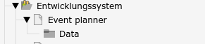
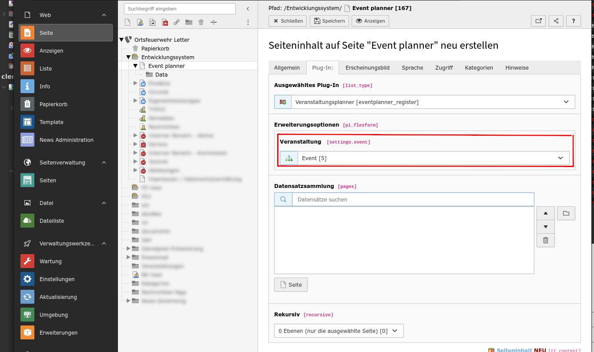

# Verwendung der Erweiterung	

## Limitierungen

Diese Erweiterung hat klar die Webseiten-Nutzer (FE-User, frontend user) als Zielgruppe. 

**WICHTIG!** Das frontend-Plugin sollte nur für eingeloggte Personen zugänglich sein.

## Anlegen einer Veranstaltung

### Anlegen der Verzeichnisstruktur

- Webseite (visualisiert den den Eventplanner)
- SystemOrdner: Enthält die Daten für den Eventplanner

### Anlegen der Veranstaltung

Dazu im SystemOrdner einen Datensatz "Name der Veranstaltung" anlegen. 

​	

### Daten eingeben

Füllen Sie mindestens die Pflichtfelder im Kopf. 

Anschließend die Arbeitseinsatzorte

Nach dem Speichern befinden sich folgende Elemente im SystemOrdner: 

### Anlegen der Visualisierung des Eventplanners

Wechsel in das Modul "Seite"

Anlegen eines neuen Inhalt-Element. Auswahl des richtigen PlugIns

Wichtig: die Veranstaltung auswählen: 

Nach dem Speichern sieht unsere Seite so aus: 

### Ergebnis

So sollte es für die Nutzer:in am Ende aussehen. Die eingeloggte Person kann sich jetzt eintragen, wo sie helfen will. 

PS: Es muss nicht immer ein Event sein. Auch andere Abstimmungen kann man damit realisieren. Bspw. welches T-Shirt-Motiv, wer gut findet oder an welchem Termin wer kann.   
