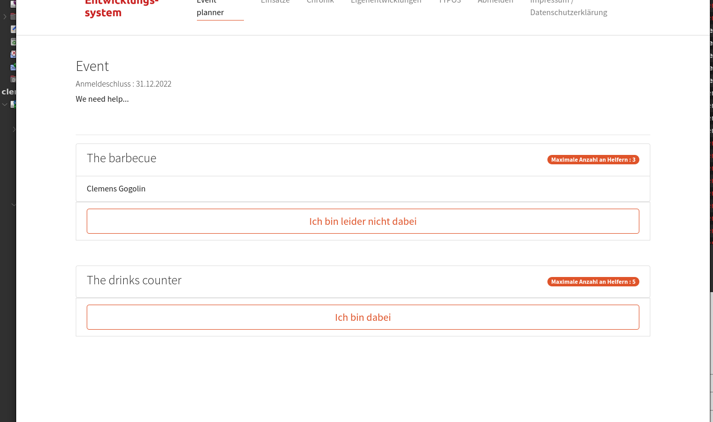

# Extension usage	

## Limitations

This extension has clearly the website users (FE users, frontend users) as target group. 

**IMPORTANT!** The frontend plugin should only be accessible for logged in users.

## Creating an event

### Create the directory structure

- Website (visualizes the eventplanner)
- SystemFolder: Contains the data for the eventplanner.

### Creating the event

To do this, create a "Name of event" record in the System folder. 

​

### Enter data

Fill in at least the mandatory fields in the header. 

Then the places of work

After saving, the following items are in the System folder: 

### Creating the visualization of the event planner.

Switch to the "Page" module

Creating a new content element. Choosing the right plug-in

Important: select the event.

After saving our page looks like this: 

### Ergebnis

So sollte es für die Nutzer:in am Ende aussehen. Die eingeloggte Person kann sich jetzt eintragen, wo sie helfen will. 

PS: Es muss nicht immer ein Event sein. Auch andere Abstimmungen kann man damit realisieren. Bspw. welches T-Shirt-Motiv, wer gut findet oder an welchem Termin wer kann.   
