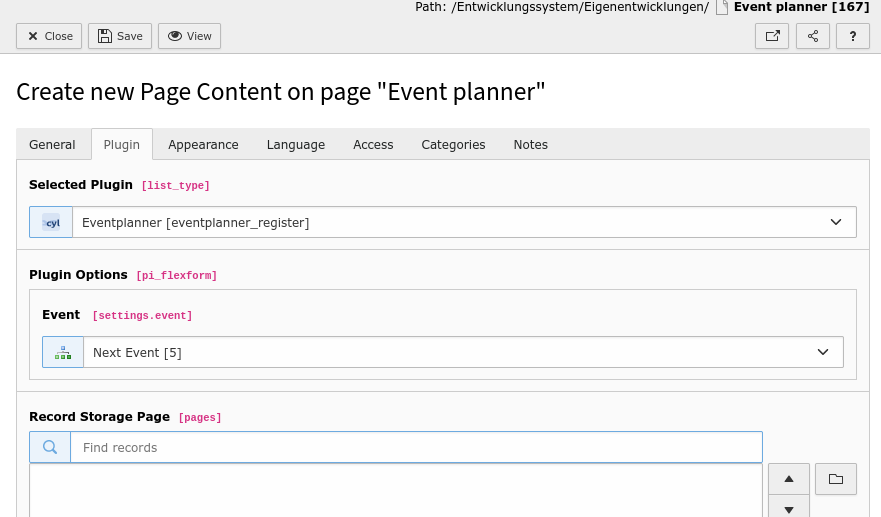

# Typo3 Extension :: eventplanner
With this small event planner the frontend users can register for certain parts of an event. For example, you can coordinate who will help at the grill and who will help at the bar.

## Limitations
* This extension is only usable for logged in frontend user. (The admin have to pay that the frontend plugin is only available for logged in users.)

## Installation

You can install the extension via the extensions module or via composer.json. 

 

In the second step you have to add the plugin to the TypoScript. To do this, you need to add the TypoScript of the plugin via the static template. 

## Configuration 

## Using

### Create pages and folder

I always do it this way: I create a page and a folder under it. The folder contains the data. The page the appropriate frontend plugin.

 

### Create the data container

In the data folder you create a data record of type "Event plan". (List module > select the data folder > press plus button)

 

Fill the data record. 

 

### Add the frontend plugin

Add the plugin on your event page. 

 

Select on the "Plugin" sheet the new event plan. 

 

